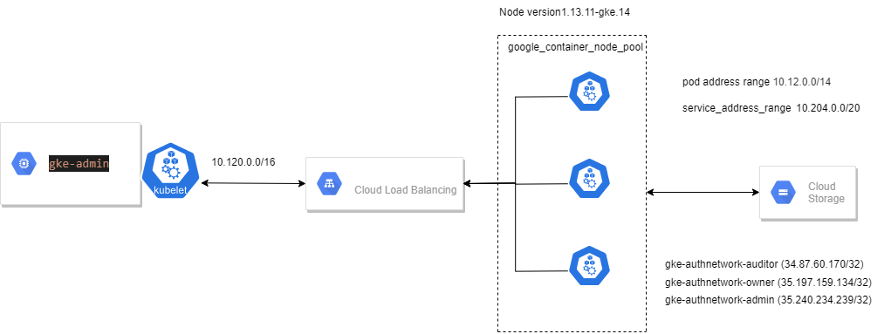

# K8s GCP cluster with gcp-admin instance

This terraform will create follows.
1) k8s private cluster
2) admin-instance
3) storage user
4) storage bucket
5) gke-admin-rbac
6) related networks
7) related firewalls

## Pre requirements

1)google cloud account

2)terraform user to create GCP related components


## Installation

1) clone the repo.
2) install terraform


```bash
terraform plan
terraform apply
```

## important

1) creds/temp-250409-f6ca481c18a5.json - change as your gcp key
2) variable project - your project name

## DIAGROM
